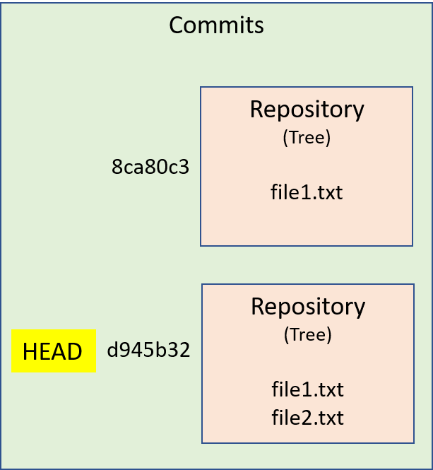
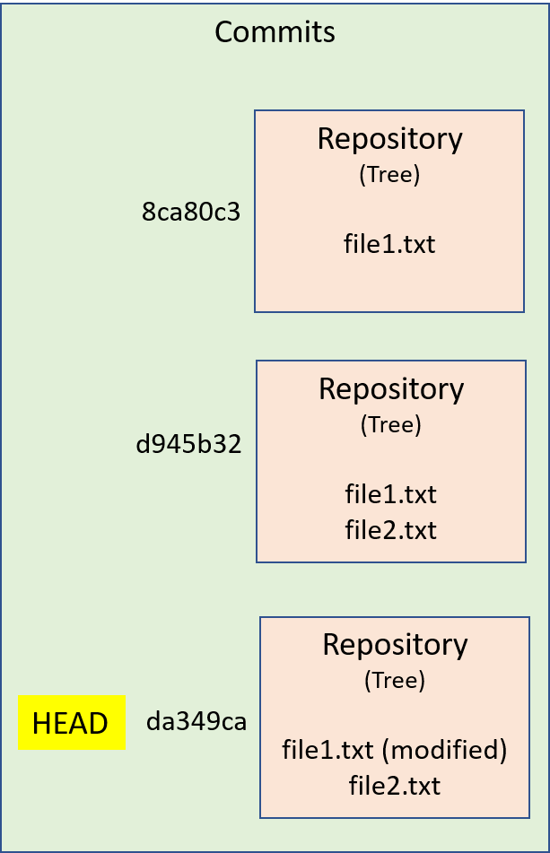

# Git Concepts
Initially, you create an empty folder on your computer.  It is simply a place
to put files.


## Git Init
When we initialize this folder to be a `git` repository using `git init`, we
create three theoretical "places" or stages for `git` to assign each file.


## Working Directory

When a new file is created in the folder containing the repository,
`git` initially considers it to be part of the working copy or working 
directory.  


Upon typing`git status`, the following will show:

```
$ git status
On branch master

No commits yet

Untracked files:
  (use "git add <file>..." to include in what will be committed)

        file1.txt

nothing added to commit but untracked files present (use "git add" to track)
```

## Adding to the Staging Area or Index
When we use `git add <filename>` git moves the file to the staging area or 
index.  


`git status` will now show:
```
$ git status
On branch master

No commits yet

Changes to be committed:
  (use "git rm --cached <file>..." to unstage)

        new file:   file1.txt

```

## Commit to the Repository
Finally, `git commit` takes all of the changes currently in the staging area 
and commits them to the tree or the repository itself.


, and you will then see the following with `git status`:
```
$ git status
On branch master
nothing to commit, working tree clean

```

## Commit History and `git log`
Assume we follow the same sequence of events by creating, adding, and commiting
a second file:


The commit history of the repository now looks like this:


and can be seen by using the `git log` command.
```
$ git log
commit d945b32718b5104b765e06608e53f418cc1e3ff6 (HEAD -> master)
Author: David Ward <david.a.ward@duke.edu>
Date:   Wed Jan 16 08:55:21 2019 -0500

    add file2.txt

commit 8ca80c39c35e85a36019b365a3f61613dccb7552
Author: David Ward <david.a.ward@duke.edu>
Date:   Wed Jan 16 08:36:18 2019 -0500

    initial commit of file1.txt
```

Notice that next to the most recent commit, there is a pointer called `HEAD`.
`HEAD` is a special pointer that points to the current version or commit of
the repository.  

## Editing File in Repository
Now, lets say I edit `file1.txt`.  Git will see that the file has changed and
will add it to the working directory.
```
$ git status
On branch master
Changes not staged for commit:
  (use "git add <file>..." to update what will be committed)
  (use "git checkout -- <file>..." to discard changes in working directory)

        modified:   file1.txt

no changes added to commit (use "git add" and/or "git commit -a")
```


The actual file in the directory will contain the edits.  `git` will assign
this modified file to the working directory.  However, `git` still has an
unmodified copy of `file1.txt` from the previous commit (it is stored in the
`.git` subdirectory created with `git init`).

Next, the command `git add file1.txt` will add it to the staging area:
```
$ git status
On branch master
Changes to be committed:
  (use "git reset HEAD <file>..." to unstage)

        modified:   file1.txt
```


and `git commit -m "modify file1.txt"` will commit it to the repository.


The commit history now looks like this:
```
$ git log
commit da349ca0ac31b1e1d6a4853a8f9721e9885ed6d4 (HEAD -> master)
Author: David Ward <david.a.ward@duke.edu>
Date:   Wed Jan 16 11:24:53 2019 -0500

    modify file1.txt

commit d945b32718b5104b765e06608e53f418cc1e3ff6 (HEAD -> master)
Author: David Ward <david.a.ward@duke.edu>
Date:   Wed Jan 16 08:55:21 2019 -0500

    add file2.txt

commit 8ca80c39c35e85a36019b365a3f61613dccb7552
Author: David Ward <david.a.ward@duke.edu>
Date:   Wed Jan 16 08:36:18 2019 -0500

    initial commit of file1.txt
```
or graphically:




## Removing a File Accidentally Added to Staging Area

If I add a file using `git add <filename>`, and then go to remove it using
`git rm <filename> -f`, the file is removed from the staging area and is also
deleted (removed from the working directory).

On the other hand, `git rm <filename> --cached` removes the file from the
staging area, but does not delete it from the working directory.  This is the 
opposite of `git add`.

## Removing a File from Repository
Let's say that you accidentally added a file to the repository with a commit.
The safest way to remove it is as follows.

`git rm --cached <filename>` will remove the file from tracking.  Then, if
you commit with `git commit -m "removed <filename>"`, the file will be removed
from the most recent repository, but will still exist in the folder (working
copy).  

An alternate is to reposition the HEAD using `git reset` as discussed below.

## Reverting to earlier commits
For this example, assume that `file1.txt` is created, added, and committed to
a repository.  Then, a second file `file2.txt` is created, added, and
committed to the repository.  

When we type `git status`, we see that all files have been added and commited.
```
$ git status
On branch master
nothing to commit, working tree clean
```
By typing `git log`, we can see the commit
history of this repository.
```
$ git log
commit e5868b0718b5104b765e06608e53f418cc1e3ff6 (HEAD -> master)
Author: David Ward <david.a.ward@duke.edu>
Date:   Wed Jan 16 08:55:21 2019 -0500

    Initial commit of file2.txt

commit 8ca80c39c35e85a36019b365a3f61613dccb7552
Author: David Ward <david.a.ward@duke.edu>
Date:   Wed Jan 16 08:36:18 2019 -0500

    first commit of file1.txt
```


We can move the `HEAD` in order to go to previous points in history in our 
repository.
### Undoing commit while keeping the changes made in the staging area
This is the reverse of `git commit`.  We are essentially removing changes 
committed to the repository, but keeping those changes in the sta   

`git reset --soft <commitID>`  
where `<commitID>` is the first few characters (usually 7) of the commit number 
of the commit to which you want to move the `HEAD`.  For example, in the 
repository created above, if we want to undo the initial commit of file2.txt, 
but not remove file2.txt from the staging area (in other words, keep the 
changes that were made and keep them "added" to the staging area), you would 
type:  
`git reset --soft 8ca80c3`

Then, we will see from `git log` that the HEAD has been moved to this commit,
and the latest commit is no longer in the history.
```
$ git log
commit 8ca80c39c35e85a36019b365a3f61613dccb7552 (HEAD -> master)
Author: David Ward <david.a.ward@duke.edu>
Date:   Wed Jan 16 08:36:18 2019 -0500

    first commit of file1.txt
``` 

By typing `git status`, we see that we have moved file2.txt back into the 
staging area.
```
$ git status
On branch master
Changes to be committed:
  (use "git reset HEAD <file>..." to unstage)

        new file:   file2.txt
```
### Undoing commit and removing files from index ("unadding")
Going back to our repository above, lets say we wanted to undo the last commit
and "unadd" the changes from the staging area, but keep the changes in the
working directory.  We do this by typing:  
`git reset --mixed <commitID>`

```
$ git reset --mixed 8ca80c3

$ git status
On branch master
Untracked files:
  (use "git add <file>..." to include in what will be committed)

        file2.txt

nothing added to commit but untracked files present (use "git add" to track)


$ git log
commit 8ca80c39c35e85a36019b365a3f61613dccb7552 (HEAD -> master)
Author: David Ward <david.a.ward@duke.edu>
Date:   Wed Jan 16 08:36:18 2019 -0500

    first commit of file1.txt

dwonl@DESKTOP-G8L84L6 MINGW64 /d/unix/git_reset (master)
```
Again, we see that the `HEAD` pointer moved to the commit we specified.
We now see in `git status` that we have a change in the working directory
(the addition of file2.txt) but it is untracked or not in the staging area.
And, `HEAD` points 


 