# Starting New Project / Repository in PyCharm
If you are starting a new PyCharm project on your local computer, and you want
to integrate it with a GitHub repository, you have three options.  

If you starting completely from scratch and do not have any local files
or an existing GitHub repository, follow __Method 1__ below.

If you have an existing GitHub repository with at least one file in it, and 
want to use those files to create a local repository and PyCharm project, use
__Method 2__ below.  

Finally, if you have already started a PyCharm project locally, but haven't yet 
created a local repository or a GitHub repository, follow __Method 3__ below.

__Note:__ These instructions were written for the Windows version of Python.
Where known, differences for the macOS version are included, but some 
differences may not have been caught.

Once you have your project set up and connected with GitHub, check out the
section below called __Git Workflow in PyCharm__.

## Method 1:  Starting from scratch in PyCharm and GitHub
### Create a new local PyCharm project
* Start a new project in PyCharm either from the splash window or from the 
menu bar by choosing `File/New Project...`
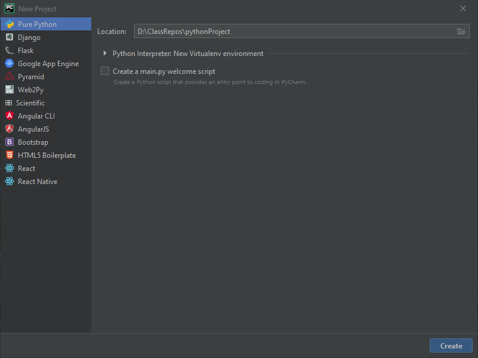
* In the Location box, replace "untitled" with the name of the folder you
would like for the new project/repository to be placed.  You can also update
the path as needed.  Make sure that "Pure Python" is selected in the left-hand
pane.  Click "Create".
* If another PyCharm window is already open, the following window will be
shown:  

* If so, select `Open in new window` and click "Ok".
* PyCharm will create the new folder and project and will create a virtual
environment within this project.

### Create local `git` repository for this project
* In the new project window, we need to activate `git`.  To do so, from the
menu bar, choose `VCS/Import into Version Control/Create Git Repository...`  
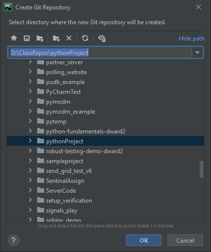
* The newly created project folder should already be selected.  Click "Ok".
* The bottom right portion of the PyCharm window should now show that `git`
is active and that you are on the master branch.  

### Link to a new GitHub repository
* In GitHub, create a new empty repository without a `README.md` file.
* Get the GitHub repository URL for cloning.
* In the PyCharm window, from the menu bar, select `VCS/Git/Remotes...`
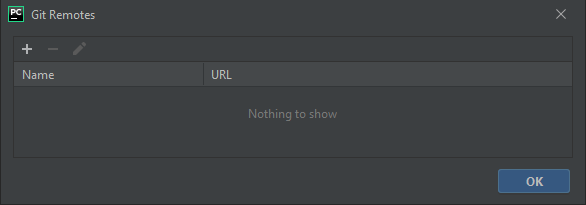
* Click on the "+" in the "Git Remotes" windows.  
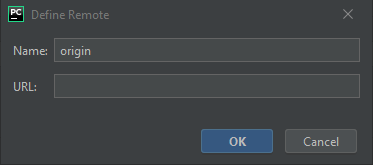
* Enter the GitHub URL into the "URL" text box and click "Ok".
* Click "Ok" to close the "Git Remotes" window.

### Create files in PyCharm
* Create files in PyCharm.  As an example, lets make a `requirements.txt` file.
* In the Projects tab on the left, select the project:    
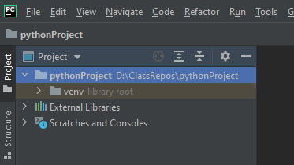
* From the menu bar, select "File/New..." and then select "File" from the 
pop-up list.  Alternatively, you can right click on the project name in the
project tab and then select "New/File" from the pop-up menu.
* Enter the name of the file into the "New File" window that appears and click
"Ok".
* The following window will appear:  
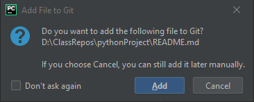
* Select "Yes" as we do want to add it to our repository.
* __NOTE__:  There will be other times when you are using PyCharm and this
window will pop-up:   
  
  asking if you want to commit certain files to your
  repository.  Often, these files will be PyCharm settings files such as `vcs`
  or spelling dictionary files.  If you don't recognize the filename, it is 
  best to say "No" and not add it to the repository.
* The newly added file will be shown in green.  This means it has been added
to the repository, but not yet committed to it.  
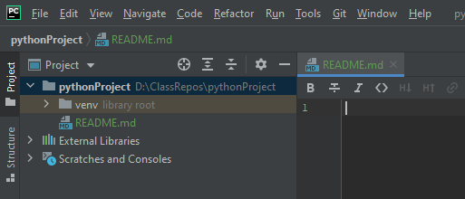
* Edit the file as desired.  Note that changes to files are automatically saved
to your local computer.  There is no need to actively save the file.
### Commit changes to repository
* Once editing is complete, the file may be committed to the repository from
the menu bar by selecting "VCS/Commit...".  

The "Commit Changes" window will show all files that have been modified since
the last commit and allow you to commit all of these changes at once.  For this
example, we only have the single file.  Add a commit message to the
Commit Message box and then click "Commit".  
* The filename will now be shown in white.  

### Push Changes to GitHub
* To push your local repository changes to GitHub, from the menu bar, select
"VCS/Git/Push..."  
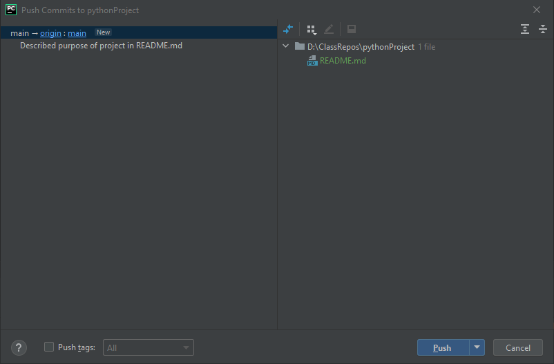
* It will show a list of commits to be pushed.  Click on "Push".

## Method 2:  Creating New Local PyCharm Project from Existing GitHub Repository
### Clone Repository
* In PyCharm, from the menu bar, choose "VCS/Checkout from Version Control/Git".
Or, if starting from the splash screen, simply choose "Checkout from Version 
Control/Git".

* Enter the clone repository URL obtained from the target GitHub repository
into the "URL" text box.  A suggested name and path for the local project 
folder will be shown in the "Directory" text box.  Modify as desired.  Then,
click "Clone".
* The following window will be shown:    
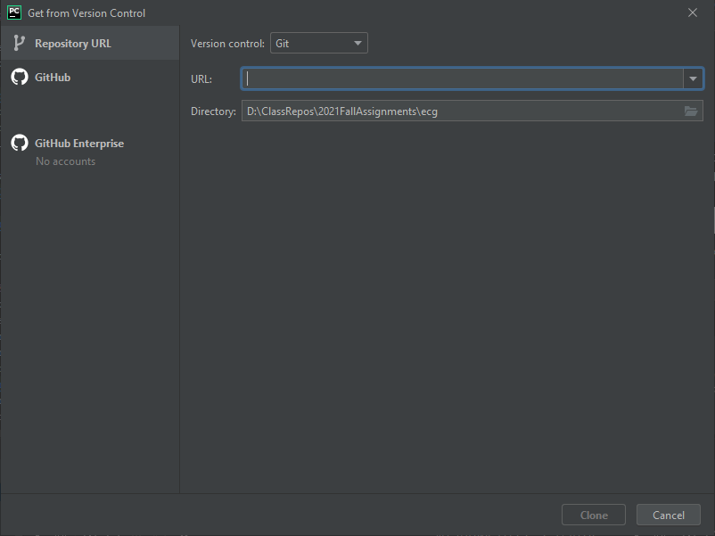
* Click "Yes".  Then, the following window will be shown:    

* Click "Yes".  A new PyCharm window will open with this project open and the
files from the Master branch of the GitHub repository will be available 
locally.
### Create a Virtual Environment
* This method does not automatically create a virtual environment.
* In PyCharm, from the menu bar, select "File/Settings..."  in Windows (for
macOS, it is "Preferences").
* In the left-hand pane of the Settings window, select "Project Interpreter"
under the "Project: YourProjectName" heading.

* It is currently using your default environment.  To create a new virtual
environment for this project, click on the gear icon to the right of the
"Project Interpreter" box and select "Add..." from the pop-up list.
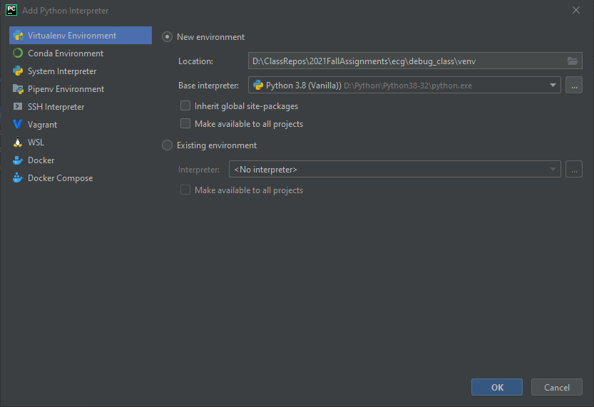
* Make sure the "Virtualenv Environment" is selected in the left-hand pane and
that the "New environment" button is selected in the right-hand pane.  Click
"Ok".
* A new virtual environment will be created for this project.  You can then
add packages as needed using a requirements.txt file.

## Method 3:  Creating a GitHub repository from an existing PyCharm project
These steps assume that you have an existing PyCharm project with files in it,
but have not yet created a local `git` repository or a GitHub repository.

* Follow the steps in __Method 1__ under the heading __Create local `git` 
repository for this project__ above.
* Follow the steps in __Method 1__ under the heading __Link to a new GitHub 
repository__ above.  It is very important that the new GitHub repository you 
create is completely empty.  If you initialize it with a README.md, the push 
of your local repository to GitHub will fail.
* Next, in PyCharm, you will need to add the files you want to put into the repository.
Untracked files will be shown with red names.  Select a file that you want
to add in the Projects tab and, from the menu bar, select "VCS/Git/Add".
* Do this for all of the files you wish to add to the repository.  Their 
filenames should now be green.  
* Commit the added files to the repository following the steps above under the
heading __Commit changes to repository__ in __Method 1__.
* Push the commit to GitHub using the steps above under the heading 
__Push Changes to GitHub__ in __Method 1__.
 

## Installing Packages in Virtual Environments in PyCharm
### Use `requirements.txt`
* Create or clone a `requirements.txt` file into your project.
* PyCharm should recognize the presence of this file and ask if you want to
install any uninstalled packages found in `requirements.txt`.  

* Click on "Install requirements" and then click on "Ok" in the window that
opens.
* If PyCharm does not automatically recognize the `requirements.txt` file,
you made need to set this function up in Settings.  Open the Settings (or
Preferences for macOS) window and select "Python Integrated Tools" under the
Tools heading in the left-hand pane.  
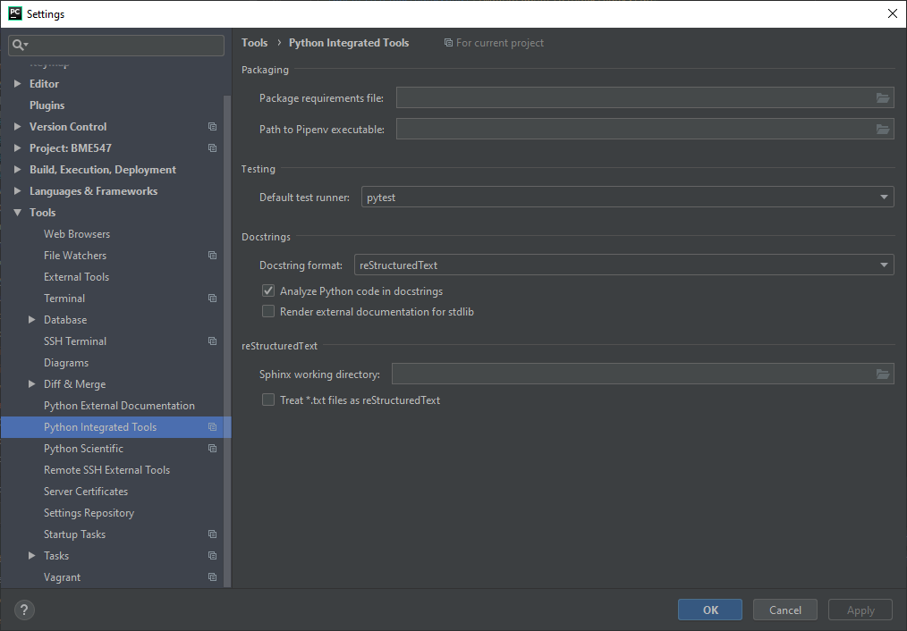
*  Enter `requirements.txt` into the "Package requirements file" box.

### Install Single Packages
* Although not recommended, if you prefer to install a single package and not
use the `requirements.txt` file to do so, open the Settings (or Preferences
for macOS) window and select select "Project Interpreter"
under the "Project: YourProjectName" heading.

* Click the "+" on the right side of the window at the top of the list of 
packages.  An "Available Packages" window will open.  Find the package you
want to install and click on the "Install Packages" button.
 
## Git Workflow in PyCharm
Once your local PyCharm project and `git` repository are set up and linked to
GitHub per the instructions above, here is the suggested `git` workflow in
PyCharm.
* In PyCharm, making sure that the `master` branch is active, make a new
feature branch.  From the menu bar, select "VCS/Git/Branches..." and then
select "+ New Branch" from the pop-up list.  
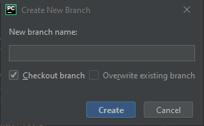
* Enter the name of your new branch and click "Ok".  It will now be shown as
the active branch in the status bar in the lower right corner of the PyCharm
window.
*  Add/modify code as needed.  
*  When new files are added, make sure to add them to the repository when 
prompted.  These new files will have green filenames.
* When existing files in the repository are modified, they will have blue
filenames to show that they have been modified.  These files do not need to
be added to the repository as PyCharm automatically adds existing repository
files to the staging area when modified.
* When ready to make a commit, follow the steps under the heading
__Commit changes to repository__ under __Method 1__ to commit your changes.
* When you are ready to merge the feature branch, push it to GitHub following
the instructions above under the heading __Push Changes to GitHub__.  A new 
feature branch on GitHub should be created with the same name as your local
branch.
* In GitHub, open a Pull Request to merge the newly pushed branch into the
`master` branch and confirm the merge once all automated tests have passed.
* Back in PyCharm, checkout the `master` branch by selecting 
"VCS/Git/Branches..." from the menu bar, and then select `master` from the 
pop-up list and "Checkout" from the sublist that opens.  Verify that `master`
is shown as the active branch in the status bar on the bottom right.  Note that
any changes you made on the feature branch are no longer visible as they have
been merged onto the `master` branch on GitHub, but not locally.
* In order to get the updates to the GitHub `master` branch, we need to pull 
in the most recent `master` branch from GitHub by selecting "VCS/Git/Pull..."
from the menu bar.  

* Make sure that `origin/master` is selected as the Branch to Merge, and then
click "Pull".
* The merged `master` branch on GitHub is now available locally.  Continue
this cycle. 

